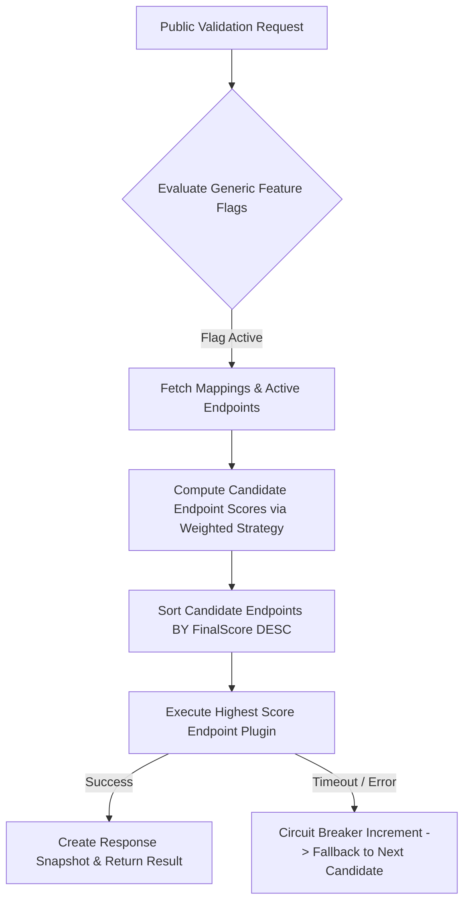

# Product Specification: 03. API Contract & Engine Flow

## 1. OpenAPI-First & Compatibility Policy

> [!IMPORTANT]
> 1. **OpenAPI-First:** Seluruh endpoint wajib menggunakan `@hono/zod-openapi`. Dokumentasi Swagger / Scalar UI dihasilkan secara otomatis dari kode.
> 2. **Backward Compatibility Policy:** Public API (`/api/v1/public/...`) **DILARANG HARUS** mengalami *breaking change*. Perubahan skema response lama tidak diperbolehkan. Jika ada perubahan signifikan, rilis rute `/api/v2/public/...` atau buat **Capability Version** baru (`v2`).

- **OpenAPI JSON Spec:** `/api/v1/openapi.json`
- **Interactive Swagger UI:** `/api/v1/docs`

---

## 2. Validation Engine Execution Flow (Configurable Weighted Scoring)

Validation Engine mengeksekusi kandidat provider berdasarkan **Configurable Weighted Scoring Strategy**. Engine membaca bobot komponen (*Health*, *Latency*, *Success Rate*, *Cost*, *Manual Weight*) dari konfigurasi database secara fleksibel tanpa hardcode rumus tertentu.



---

## 3. Standard Envelope JSON Format

### Standard Success Response (`200 OK`)

```json
{
  "success": true,
  "message": "Validation Success",
  "data": {
    "gameCode": "mobile-legends",
    "userId": "12345678",
    "zoneId": "2001",
    "capabilities": {
      "nickname": "ProGamer99",
      "region": "ID",
      "firstTopupAvailable": true
    }
  },
  "meta": {
    "responseTimeMs": 342,
    "timestamp": "2026-08-02T07:42:00.000Z"
  },
  "error": null
}
```

### Standard Error Response (`4xx / 5xx`)

```json
{
  "success": false,
  "message": "Provider Timeout",
  "data": null,
  "meta": {
    "responseTimeMs": 3005,
    "timestamp": "2026-08-02T07:42:00.000Z"
  },
  "error": {
    "code": "PROVIDER_TIMEOUT",
    "details": "Provider endpoint did not respond within 3000ms"
  }
}
```

---

## 4. Admin & Analytics APIs Overview

- **`GET /api/v1/public/health`**: Public System & DB Health check.
- **`GET /api/v1/public/health/providers`**: Health check per Provider Endpoint.
- **`GET /api/v1/admin/analytics/observability`**: Metrik Observability (p95/p99 latency, success rate, cost).
- **`GET /api/v1/admin/feature-flags`**: Manajemen Generic Feature Flags (`validation.smart-scoring`, `provider.melpa`, dll).
- **`POST /api/v1/admin/system/config-versions/:id/rollback`**: 1-Click Config Rollback API.
